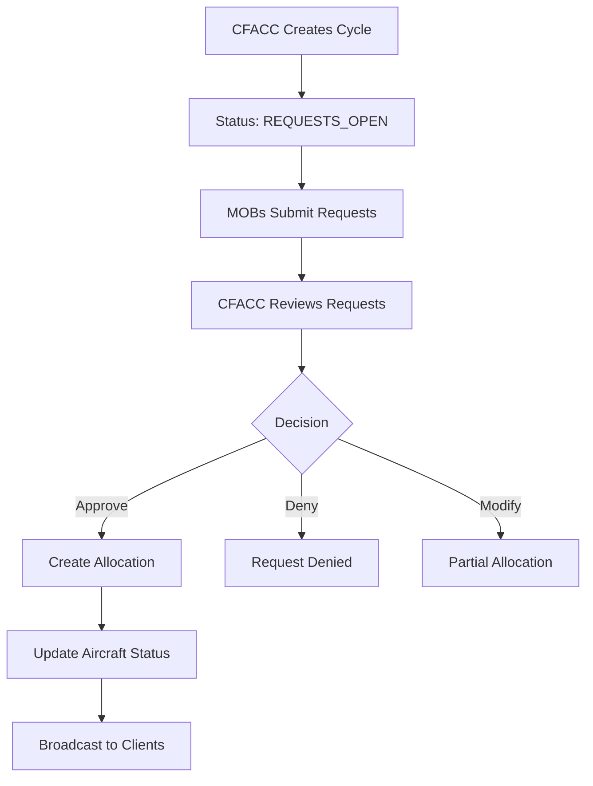
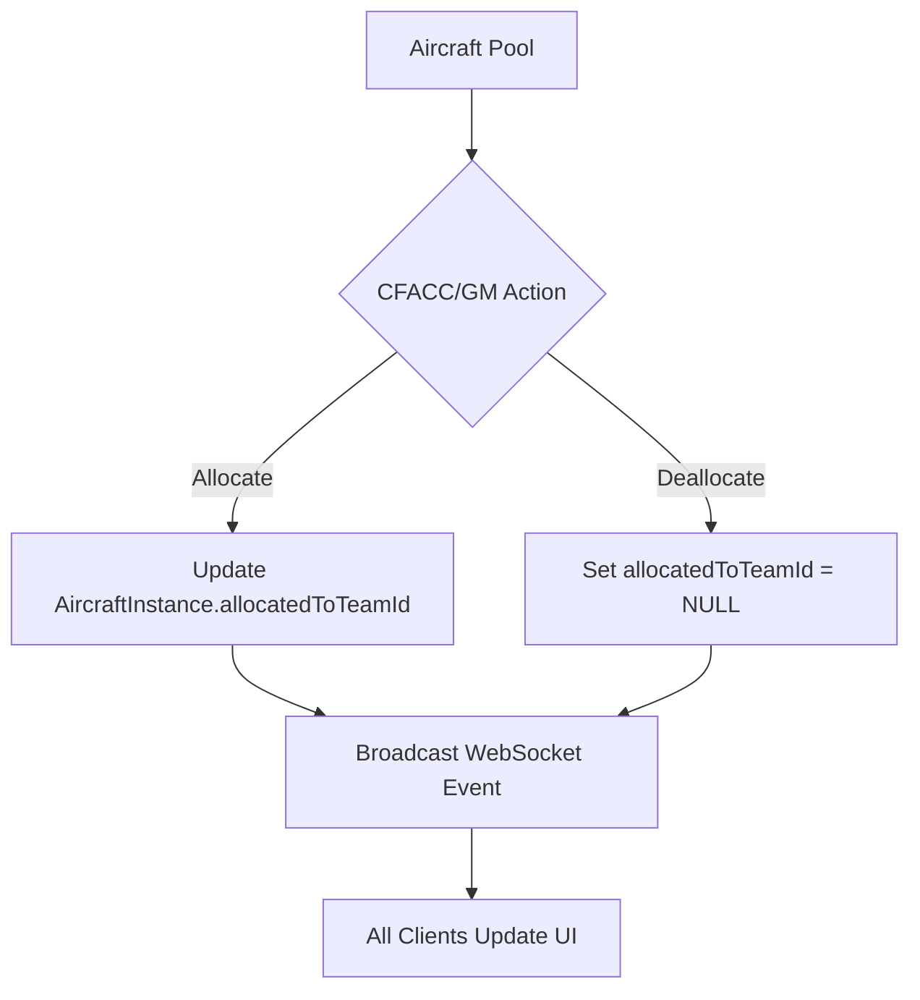

# Aircraft Allocation System Simplification - Design Document

## Executive Summary

This document outlines the transition from a complex request/approval allocation cycle system to a simplified table-based direct allocation system for aircraft management in Pacific Shield.

**Current System:** Multi-step workflow with AllocationCycle → AircraftRequest → Review → AircraftAllocation
**Target System:** Direct allocation table showing aircraft assigned to MOBs with real-time WebSocket updates

---

## 1. Current System Analysis

### 1.1 Database Schema (Current)

The current system uses 4 main models for allocation:

```prisma
model AllocationCycle {
  id        Int                     @id @default(autoincrement())
  gameId    Int
  turn      Int
  status    AllocationCycleStatus   @default(PENDING)
  requests  AircraftRequest[]
  allocations AircraftAllocation[]
}

model AircraftRequest {
  id                   Int                     @id
  allocationCycleId    Int
  teamId               Int
  aircraftType         AircraftType
  quantityRequested    Int
  missionJustification String
  priority             Int
  status               AllocationRequestStatus @default(PENDING)
  quantityAllocated    Int                     @default(0)
  cfaccNotes           String?
}

model AircraftAllocation {
  id                 Int    @id
  allocationCycleId  Int
  aircraftRequestId  Int
  aircraftInstanceId Int    @unique
  allocatedToTeamId  Int
}

model AircraftInstance {
  id               Int                        @id
  callSign         String                     @unique
  type             AircraftType
  subtype          String?
  status           AircraftStatus             @default(FMC)
  teamId           Int
  allocationStatus AircraftAllocationStatus   @default(AVAILABLE)
  allocation       AircraftAllocation?
}
```

**Key Issues:**
- Complex workflow with multiple states (PENDING, REQUESTS_OPEN, ANALYSIS, ALLOCATED, CLOSED)
- Request/approval process adds unnecessary overhead
- Duplicate data (AircraftInstance.teamId vs allocation.allocatedToTeamId)
- Multiple joins required to display simple allocation table

### 1.2 Current Workflow



### 1.3 Current API Endpoints (32 total)

**Allocation Cycles:**
- POST `/allocation/cycles` - Create cycle
- GET `/allocation/cycles/game/:gameId/latest` - Get latest cycle
- PUT `/allocation/cycles/:cycleId` - Update cycle status

**Requests:**
- POST `/allocation/requests` - Submit request
- GET `/allocation/requests/cycle/:cycleId` - Get all requests for cycle
- GET `/allocation/requests/team/:teamId` - Get team requests
- PUT `/allocation/requests/:requestId` - Update request
- DELETE `/allocation/requests/:requestId` - Delete request
- PUT `/allocation/requests/:requestId/review` - CFACC review

**Allocations:**
- POST `/allocation/allocations` - Create allocation
- DELETE `/allocation/allocations/:allocationId` - Delete allocation
- GET `/allocation/allocations/cycle/:cycleId` - Get allocations

**Aircraft Management:**
- POST `/allocation/spawn-aircraft` - GM spawn aircraft
- DELETE `/allocation/aircraft/:id` - GM delete aircraft
- GET `/allocation/aircraft/game/:gameId` - Get all aircraft

**Pool Management:**
- GET `/allocation/pool` - Get unallocated pool
- GET `/allocation/aircraft-pool/:gameId` - Get pool statistics
- POST `/allocation/aircraft-pool/:gameId/refresh` - Refresh pool

### 1.4 Current Frontend Components

**Key Files:**
- `caoc-dashboard.component.ts/html` - CFACC allocation interface
- `allocation.state.ts` - NgRx state management
- `allocation-signal.service.ts` - Signal-based state with WebSocket
- `allocation-websocket.service.ts` - WebSocket integration
- `allocation.actions.ts` - NgRx actions
- `allocation.effects.ts` - NgRx effects
- `allocation.selectors.ts` - NgRx selectors

**Current Features:**
- Request submission forms
- Request review tables
- Allocation drag-and-drop interface
- Real-time updates via WebSocket
- Role-based access control

---

## 2. Proposed Simplified System

### 2.1 Target UI Design (Based on Task Description)

**Table Structure:**
```
+------------+--------------------+-----------+--------+
| Call Sign  | Apportioned Status | Allocated | Status |
+------------+--------------------+-----------+--------+
| AW01       | Apportioned        | JBPHH     | FMC    |
| AW02       | Apportioned        | Yokota    | FMC    |
| ME01       | Apportioned        | Andersen  | FMC    |
| BO11       | Apportioned        | Kadena    | FMC    |
+------------+--------------------+-----------+--------+
```

**Grouped by Aircraft Type:**
- C-130 ARROW (AW callsigns)
- C-17 MOOSE (ME callsigns)
- C-5 BOSCO (BO callsigns, with BOBCAT/RHINO subtypes)

**Real-time Distribution:**
- All changes broadcast via WebSocket
- MOB teams see updates immediately
- CFACC/GM can modify allocations directly

### 2.2 Simplified Database Schema

**OPTION A: Minimal Changes (Recommended)**
```prisma
model AircraftInstance {
  id               Int            @id
  callSign         String         @unique
  type             AircraftType
  subtype          String?
  status           AircraftStatus @default(FMC)
  rangeHexes       Int
  
  // Direct allocation - no intermediate tables
  allocatedToTeamId Int?         // NULL = unallocated
  allocatedToTeam   Team?         @relation(fields: [allocatedToTeamId], references: [id])
  allocatedAt       DateTime?
  
  // Keep original teamId for ownership tracking
  teamId           Int
  team             Team           @relation(fields: [teamId], references: [id])
  
  // Location tracking
  locationType     LocationType
  locationFosId    String?
  locationFos      ForwardOperatingSite?
  locationHex      String?
}
```

**Key Changes:**
- Remove `allocationStatus` enum (not needed)
- Add `allocatedToTeamId` directly to AircraftInstance
- Add `allocatedAt` timestamp for tracking
- Remove `allocation` relation to AircraftAllocation
- **Deprecate but keep:** AllocationCycle, AircraftRequest, AircraftAllocation (for historical data)

**OPTION B: Add Apportionment Field**
```prisma
model AircraftInstance {
  // ... same as Option A ...
  
  apportionedStatus String?       // "Apportioned", "Available", "Reserved"
  allocatedToTeamId Int?
  allocatedToTeam   Team?
}
```

### 2.3 Simplified Workflow



**Benefits:**
- Single database update per allocation
- No workflow states to manage
- Direct queries for allocation table
- Simpler WebSocket events

### 2.4 Simplified API Endpoints (12 total)

**Keep & Modify:**
```typescript
// Aircraft Management (Keep)
GET    /allocation/aircraft/game/:gameId       // Get all aircraft with allocations
POST   /allocation/aircraft/spawn              // GM spawn aircraft
DELETE /allocation/aircraft/:id                // GM delete aircraft

// Direct Allocation (Modify)
PUT    /allocation/aircraft/:id/allocate       // Allocate aircraft to team
PUT    /allocation/aircraft/:id/deallocate     // Remove allocation
GET    /allocation/aircraft/allocated/:teamId  // Get team's aircraft

// Bulk Operations (New)
PUT    /allocation/aircraft/bulk-allocate      // Allocate multiple aircraft
GET    /allocation/aircraft/table/:gameId      // Get allocation table data

// Pool Statistics (Keep)
GET    /allocation/aircraft-pool/:gameId       // Get pool statistics
POST   /allocation/aircraft-pool/:gameId/refresh // Refresh pool
```

**Remove:**
- All allocation cycle endpoints
- All aircraft request endpoints
- Old allocation endpoints

### 2.5 WebSocket Events

**Simplified Events:**
```typescript
// Aircraft Allocation Changed
{
  type: 'aircraftAllocationChanged',
  payload: {
    aircraftId: number,
    callSign: string,
    allocatedToTeamId: number | null,
    allocatedToTeamName: string | null,
    allocatedAt: string | null,
    previousTeamId: number | null
  }
}

// Bulk Allocation Changed
{
  type: 'bulkAircraftAllocationChanged',
  payload: {
    changes: Array<{
      aircraftId: number,
      callSign: string,
      allocatedToTeamId: number | null,
      allocatedToTeamName: string | null
    }>
  }
}

// Aircraft Spawned (Keep)
{
  type: 'aircraftSpawned',
  payload: AircraftInstance
}

// Aircraft Removed (Keep)
{
  type: 'aircraftRemoved',
  payload: { aircraftId: number }
}
```

**Remove:**
- `allocationCycleCreated`
- `allocationCycleStatusChanged`
- `aircraftRequestCreated`
- `aircraftRequestUpdated`
- `aircraftRequestDeleted`
- `aircraftRequestReviewed`
- `aircraftAllocated` (replace with `aircraftAllocationChanged`)
- `aircraftDeallocated` (replace with `aircraftAllocationChanged`)

---

## 3. Frontend Design

### 3.1 Allocation Table Component

**New Component:** `aircraft-allocation-table.component.ts`

```typescript
interface AllocationTableRow {
  id: number;
  callSign: string;
  type: AircraftType;
  subtype?: string;
  apportionedStatus: string; // "Apportioned" | "Available"
  allocatedTo: string;        // Team name or "Unallocated"
  allocatedToTeamId?: number;
  status: AircraftStatus;     // FMC | Destroyed
  statusColor: string;        // For UI styling
}

interface AircraftTypeGroup {
  type: AircraftType;
  displayName: string;        // "C-130 ARROW", "C-17 MOOSE", "C-5 BOSCO"
  aircraft: AllocationTableRow[];
}
```

**Table Features:**
- Grouped by aircraft type (C-130, C-17, C-5)
- Color-coded status (green for FMC, red for Destroyed)
- Inline editing for CFACC/GM
- Mat-select dropdown for MOB allocation
- Real-time updates via signals
- Responsive Material Design table

### 3.2 Simplified State Management

**Signal-based (Preferred):**
```typescript
// allocation-signal.service.ts
export class AllocationSignalService {
  private aircraftSignal = signal<AircraftInstance[]>([]);
  
  readonly aircraftByType = computed(() => {
    const aircraft = this.aircraftSignal();
    return {
      C130: aircraft.filter(a => a.type === 'C130'),
      C17: aircraft.filter(a => a.type === 'C17'),
      C5: aircraft.filter(a => a.type === 'C5'),
    };
  });
  
  readonly allocationTable = computed(() => {
    // Transform to AllocationTableRow[]
  });
  
  allocateAircraft(aircraftId: number, teamId: number): Promise<void>
  deallocateAircraft(aircraftId: number): Promise<void>
}
```

**NgRx (Alternative):**
```typescript
// allocation.state.ts
export interface AllocationState {
  aircraft: AircraftInstance[];
  loading: boolean;
  error: string | null;
}

// Remove: currentCycle, requests, allocations, unallocatedPool
```

### 3.3 UI Components to Update

**Files to Modify:**
- `caoc-dashboard.component.ts/html` - Replace request/approval UI with allocation table
- `mob-dashboard.component.ts/html` - Show allocated aircraft for MOB
- `allocation-signal.service.ts` - Simplify to handle direct allocations
- `allocation.state.ts` - Remove cycle/request state
- `allocation.actions.ts` - Simplify actions
- `allocation.selectors.ts` - Simplify selectors

**Files to Remove:**
- `aircraft-request-dialog.component.ts/html` - No longer needed
- Request review components

---

## 4. Migration Strategy

### 4.1 Database Migration Options

**OPTION 1: Clean Start (Recommended for Development)**
```sql
-- 1. Drop old allocation tables
DROP TABLE IF EXISTS "AircraftAllocation";
DROP TABLE IF EXISTS "AircraftRequest";
DROP TABLE IF EXISTS "AllocationCycle";
DROP TABLE IF EXISTS "AircraftPool";

-- 2. Add new fields to AircraftInstance
ALTER TABLE "AircraftInstance"
  ADD COLUMN "allocatedToTeamId" INTEGER,
  ADD COLUMN "allocatedAt" TIMESTAMP,
  DROP COLUMN "allocationStatus";

-- 3. Update foreign key
ALTER TABLE "AircraftInstance"
  ADD CONSTRAINT "AircraftInstance_allocatedToTeamId_fkey" 
  FOREIGN KEY ("allocatedToTeamId") REFERENCES "Team"("id");
```

**OPTION 2: Migrate Existing Data**
```sql
-- 1. Migrate current allocations to new model
UPDATE "AircraftInstance" ai
SET 
  "allocatedToTeamId" = aa."allocatedToTeamId",
  "allocatedAt" = aa."createdAt"
FROM "AircraftAllocation" aa
WHERE ai.id = aa."aircraftInstanceId";

-- 2. Then drop old tables
-- 3. Add constraints
```

**OPTION 3: Dual System (Transition Period)**
- Keep both systems running
- Gradually migrate teams to new system
- Remove old system after verification

### 4.2 Code Migration Steps

1. **Phase 1: Backend (Database & API)**
   - Update Prisma schema
   - Run `npx nx prisma-generate pac-shield-api`
   - Modify allocation.service.ts for direct allocation
   - Update allocation.controller.ts endpoints
   - Update WebSocket events in game.gateway.ts
   - Test API endpoints

2. **Phase 2: Frontend (State Management)**
   - Update allocation-signal.service.ts
   - Simplify allocation.state.ts
   - Update allocation.actions.ts and effects
   - Test state updates

3. **Phase 3: Frontend (UI)**
   - Create aircraft-allocation-table.component
   - Update caoc-dashboard.component
   - Update mob-dashboard.component
   - Remove old dialog components
   - Test UI interactions

4. **Phase 4: Cleanup**
   - Remove deprecated code
   - Update tests
   - Update documentation

---

## 5. Open Questions for User

Before proceeding with implementation, please clarify:

1. **"Apportioned Status"** - What does this mean?
   - Is it just a label for "allocated"?
   - Is it a separate field indicating theater assignment?
   - Should it have values like: "Apportioned", "Available", "Reserved"?

2. **MEDCOM Allocation** - Can MEDCOM receive aircraft allocations?
   - Currently not a MOB in the system
   - Should we add MEDCOM to the MOB list?

3. **Migration Strategy** - Which option?
   - Option 1: Clean start (lose existing allocations)
   - Option 2: Migrate data (keep allocation history)
   - Option 3: Dual system (transition period)

4. **Permissions** - Who can modify allocations?
   - CFACC/GM only (current model)
   - MOBs can allocate their own aircraft
   - Both?

5. **Historical Data** - Keep old allocation workflow tables?
   - Keep for historical queries
   - Remove completely
   - Archive to separate database

---

## 6. Implementation Estimate

**Backend Changes:**
- Database schema: 2-3 hours
- API endpoints: 3-4 hours
- WebSocket events: 1-2 hours
- Testing: 2-3 hours
- **Total: 8-12 hours**

**Frontend Changes:**
- New table component: 4-5 hours
- State management: 2-3 hours
- Dashboard updates: 3-4 hours
- Cleanup old code: 2-3 hours
- Testing: 3-4 hours
- **Total: 14-19 hours**

**Overall Estimate: 22-31 hours**

---

## 7. Recommended Approach

Based on the analysis, I recommend:

1. **Use Option A for database schema** - Direct allocation without intermediate tables
2. **Clean start migration** - Remove old workflow (saves development time)
3. **Signal-based state management** - Simpler than NgRx for this use case
4. **Phased rollout** - Backend → State → UI → Cleanup
5. **CFACC/GM only permissions** - Maintain current access control

This approach minimizes complexity while delivering the required functionality for a simple allocation table with real-time updates.
