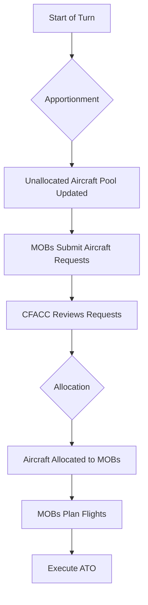

# CFACC Allocation System - Frontend UI/UX Design

This document outlines the design for the frontend components and user experience of the CFACC aircraft allocation system.

---

## 1. High-Level Workflow

The new allocation system will be integrated into the existing planning phase of the game.

---

## 2. MOB Perspective: Request Submission

A new "Request Aircraft" button will be added to the main game interface for MOB players, likely near the ATO table.

### 2.1. `AircraftRequestDialogComponent`

-   **Trigger**: Clicking the "Request Aircraft" button.
-   **Purpose**: A modal dialog for creating and submitting aircraft requests.
-   **Form Fields**:
    -   **Aircraft Type**: Dropdown (C-17, C-130, C-5).
    -   **Quantity**: Number input.
    -   **Mission Justification**: Dropdown (FOS Establishment, Resupply, MEDCOM Support, etc.).
    -   **Priority**: Slider or number input (1-5).
    -   **Rationale**: Text area for detailed justification.
-   **Actions**: "Submit Request" and "Cancel".

### 2.2. MOB Dashboard Integration

-   A new tab or section in the MOB's view will display their submitted requests and the status of each (`Pending`, `Approved`, `Denied`).
-   Once aircraft are allocated, they will appear in the MOB's list of available aircraft for flight planning, just as they do now.

---

## 3. CFACC Perspective: Allocation Dashboard

The CFACC will have a new "Allocation Dashboard" tab, which will be the central hub for managing the allocation process.

### 3.1. `CfaccAllocationDashboardComponent`

This component will be a multi-panel view:

#### Panel 1: Request Review

-   **Display**: A table of all `AircraftRequest` items.
-   **Columns**: MOB Team, Aircraft Type, Qty Requested, Justification, MOB Priority, Status.
-   **Actions**:
    -   Clicking a request opens a detail view.
    -   Ability to sort and filter requests.

#### Panel 2: Unallocated Aircraft Pool

-   **Display**: A list or card view of all available aircraft (`AircraftInstance` with `allocationStatus: 'AVAILABLE'`).
-   **Information**: Call Sign, Type, Current Location.

#### Panel 3: Decision Support

-   **Display**: Key strategic information to aid decision-making.
    -   Current OPORD/EXORD mission priorities.
    -   A summary of each MOB's current capabilities and operational status.
    -   Resource optimization recommendations (future enhancement).

### 3.2. Allocation Interface

-   **Drag-and-Drop**: The primary interaction will be to drag an aircraft from the "Unallocated Pool" panel and drop it onto a request in the "Request Review" panel.
-   **Alternative**: A selection-based system where the CFACC clicks an aircraft, then clicks an "Allocate" button on the desired request.
-   **Confirmation**: When an aircraft is allocated, a dialog will confirm the action and the `AircraftAllocation` record will be created. The UI will update in real-time.

---

## 4. NgRx State Management (Store)

A new `allocation` slice will be added to the NgRx store.

### 4.1. `AllocationState`

-   `cycles`: A dictionary of `AllocationCycle` objects.
-   `requests`: A dictionary of `AircraftRequest` objects.
-   `allocations`: A dictionary of `AircraftAllocation` objects.
-   `unallocatedPool`: An array of `AircraftInstance` IDs.
-   `loading`: Boolean flags for async operations.

### 4.2. New Actions

-   `[Allocation] LoadCycle`, `loadCycleSuccess`, `loadCycleFailure`
-   `[Allocation] CreateRequest`, `createRequestSuccess`, `createRequestFailure`
-   `[Allocation] LoadRequests`, `loadRequestsSuccess`, `loadRequestsFailure`
-   `[Allocation] CreateAllocation`, `createAllocationSuccess`, `createAllocationFailure`
-   And so on for all API interactions.

### 4.3. New Selectors

-   `selectUnallocatedAircraft`
-   `selectRequestsForCycle`
-   `selectAllocationStatusForTeam`
-   And more for deriving UI state from the store.

## 5. Integration with Existing Components

-   The `FlightPlannerDialogComponent` will be updated to only show aircraft that have been allocated to the MOB's team for the current turn.
-   The `AtoTableComponent` will function as it does now, but the pool of aircraft available to plan with is determined by the allocation results.
