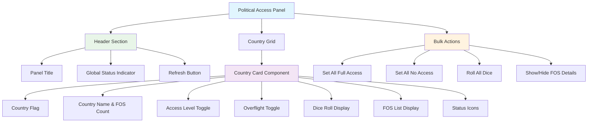

# Political Access Control Interface - UI Design

## Overview
GM interface for managing country-specific political access levels with real-time visual feedback and dice roll values.

## UI Component Structure



## Component Layout

### Country Card Layout
```
┌─────────────────────────────────┐
│ 🇯🇵 JAPAN (3/5 FOS Occupied)   │
│                                 │
│ Access: [Full Access ▼]        │
│ Overflight: [Yes ▼]            │
│                                 │
│ 🎲 Dice Roll: 14               │
│ FOS: 1✓, 2✓, 3✓, 4○, 5○        │
│ ✅ Full diplomatic relations    │
└─────────────────────────────────┘
```

## Material Components Used

- **mat-card**: Country cards with elevation
- **mat-select**: Access level dropdowns
- **mat-button**: Action buttons
- **mat-chip**: Status indicators
- **mat-icon**: Status icons and dice symbols
- **mat-grid-list**: Responsive country grid
- **mat-toolbar**: Panel header
- **mat-badge**: Notification indicators

## Tailwind Classes

- **Grid Layout**: `grid grid-cols-1 md:grid-cols-2 lg:grid-cols-3 xl:grid-cols-4 gap-4`
- **Card Styling**: `p-4 rounded-lg shadow-md hover:shadow-lg transition-shadow`
- **Flag Display**: `w-8 h-6 object-cover rounded-sm border border-md-outline`
- **Button Grouping**: `flex gap-2 justify-between items-center`
- **Typography**: `text-md-on-surface text-sm font-medium`

## Country-Specific FOS Assignments

Each country controls specific Forward Operating Sites (FOS) that are affected by political access decisions:

### 🇯🇵 Japan (5 FOS)
- **FOS Numbers**: 1, 2, 3, 4, 5
- **Color Distribution**: All Green (high strategic value)

### 🇵🇭 Philippines (5 FOS)
- **FOS Numbers**: 6, 7, 8, 9, 10
- **Color Distribution**: Green (6, 8), Yellow (7, 10), Red (9)

### 🇮🇩 Indonesia (9 FOS)
- **FOS Numbers**: 11, 12, 15, 16, 17, 18, 19, 20, 21
- **Color Distribution**: Green (11, 15, 16, 17, 20, 21), Yellow (18), Red (12, 19)

### 🇧🇳 Brunei (2 FOS)
- **FOS Numbers**: 13, 14
- **Color Distribution**: Yellow (both strategic chokepoints)

### 🇸🇬 Singapore (1 FOS)
- **FOS Numbers**: 22
- **Color Distribution**: Green (vital shipping lane)

### 🇲🇾 Malaysia (2 FOS)
- **FOS Numbers**: 23, 24
- **Color Distribution**: Green (23), Yellow (24)

### 🇹🇭 Thailand (6 FOS)
- **FOS Numbers**: 25, 26, 30, 32, 33, 34
- **Color Distribution**: Green (30, 33), Yellow (25, 32), Red (26, 34)

### 🇰🇭 Cambodia (1 FOS)
- **FOS Numbers**: 29
- **Color Distribution**: Yellow (regional significance)

### 🇻🇳 Vietnam (5 FOS)
- **FOS Numbers**: 27, 28, 31, 36, 37
- **Color Distribution**: Green (27, 31, 37), Yellow (28, 36)

### 🇱🇦 Laos (1 FOS)
- **FOS Numbers**: 35
- **Color Distribution**: Red (challenging logistics)

### 🇮🇳 India (8 FOS)
- **FOS Numbers**: 38, 39, 40, 41, 42, 43, 44, 45
- **Color Distribution**: Green (39, 42, 43, 45), Yellow (38, 40, 41, 44)

## Data Structure

```typescript
interface PoliticalAccessCard {
  country: Country;
  countryDisplayName: string;
  flagEmoji: string;
  access: AccessStatus;
  overflight: AccessStatus;
  diceRoll: number;
  fosSites: FOSReference[];
  fosCount: number;
  fosOccupied: number;
  occupancyRate: number; // fosOccupied / fosCount
  lastUpdated: Date;
}

interface AccessStatusOption {
  value: AccessStatus;
  label: string;
  icon: string;
  color: string;
}

interface FOSReference {
  id: string;
  number: number;
  name: string;
  color: 'green' | 'yellow' | 'red';
  coordinates: [number, number];
  isOccupied: boolean;
  occupiedByTeam?: TeamType;
  activationTurn?: number;
}

interface FosOccupancyDisplay {
  occupied: number;
  total: number;
  percentage: number;
  displayText: string; // "3/5 FOS Occupied"
  statusColor: 'success' | 'warning' | 'error';
}
```

## Access Status Visual Mapping

| Status | Icon | Color Token | Display Label |
|--------|------|-------------|---------------|
| FULL_ACCESS | ✅ check_circle | md-primary | Full Access |
| OVERFLIGHT_ONLY | ✈️ flight | md-tertiary | Overflight Only |
| NO_ACCESS | ❌ block | md-error | No Access |

## FOS Occupancy Visual Indicators

| Occupancy Rate | Display Format | Status Color | Progress Bar |
|---------------|----------------|--------------|--------------|
| 0% (0/X) | "0/X FOS Occupied" | md-error | Red empty bar |
| 1-49% | "X/Y FOS Occupied" | md-warning | Yellow partial bar |
| 50-79% | "X/Y FOS Occupied" | md-primary | Blue partial bar |
| 80-99% | "X/Y FOS Occupied" | md-tertiary | Green partial bar |
| 100% (Y/Y) | "Y/Y FOS Occupied" | md-primary | Green full bar |

### Individual FOS Status Icons

| Status | Icon | Description | Team Indicator |
|--------|------|-------------|----------------|
| Unoccupied | ○ | Empty circle, strategic color border | None |
| Occupied | ✓ | Checkmark, team color background | Team color border |
| Contested | ⚡ | Warning icon, orange background | Multiple team colors |
| Jammed | 📡 | Signal icon, red background | Strikethrough effect |

## Interactive Elements

### Access Level Toggle
- **Component**: mat-select with custom styling
- **Options**: Full Access, Overflight Only, No Access
- **Behavior**: Immediate update on selection
- **Visual**: Color-coded border based on access level
- **FOS Impact**: Shows affected FOS count in tooltip

### Dice Roll Display
- **Component**: Custom chip with dice icon
- **Format**: "🎲 Roll: [value]"
- **Behavior**: Click to re-roll individual country
- **Visual**: Animated roll effect on update
- **Threshold**: Values 1-6 (No Access), 7-14 (Overflight), 15-20 (Full Access)

### FOS Display Section
- **Component**: Expandable mat-chip-set with occupancy indicators
- **Format**: Color-coded chips for each FOS number with status icons
- **Behavior**: Click to highlight FOS on map
- **Visual**:
  - Green/Yellow/Red chips based on strategic value
  - ✓ checkmark for occupied FOS
  - ○ circle for unoccupied FOS
  - Team color border for occupied sites
- **Tooltip**: Shows FOS coordinates, capabilities, and occupying team

### Bulk Actions
- **Set All Full Access**: Green primary button
- **Set All No Access**: Red error button
- **Roll All Dice**: Secondary button with dice icon
- **Show/Hide FOS Details**: Toggle button for expanded view
- **Export Report**: Outlined button with PDF download

## Responsive Design

- **Mobile (xs)**: Single column, stacked layout
- **Tablet (md)**: 2 columns
- **Desktop (lg)**: 3 columns
- **Large (xl)**: 4 columns

## State Management

- **Real-time updates**: WebSocket integration for multiplayer sync
- **Optimistic updates**: UI updates immediately, reverts on error
- **Cache strategy**: Local storage backup for offline resilience
- **Conflict resolution**: Last-writer-wins with timestamp validation

## Accessibility Features

- **ARIA labels**: All interactive elements labeled
- **Keyboard navigation**: Tab order and shortcuts
- **Screen reader**: Status announcements on changes
- **Color contrast**: WCAG AA compliant tokens
- **Focus indicators**: Clear visual focus states

## FOS Impact Analysis

### Strategic Assessment
The political access interface provides real-time analysis of FOS availability:

- **Total FOS Count**: 40 operational sites across 11 countries
- **Strategic Distribution**:
  - Indonesia: 9 FOS (22.5%) - Largest network
  - India: 8 FOS (20%) - Regional power projection
  - Thailand: 6 FOS (15%) - Mainland access
  - Japan, Philippines, Vietnam: 5 FOS each (37.5% combined)

### Access Impact Calculation
```typescript
interface AccessImpact {
  totalFOS: number;
  accessibleFOS: number;
  overflightOnlyFOS: number;
  deniedFOS: number;
  strategicValue: 'Low' | 'Medium' | 'High' | 'Critical';
  affectedOperations: string[];
}
```

### Real-time Effects
- **Full Access**: All FOS available for operations, logistics, and deployment
- **Overflight Only**: Limited to air transit, no ground operations or basing
- **No Access**: Complete operational denial, forces alternate routing

### Critical Dependencies
- **Singapore (FOS 22)**: Malacca Strait chokepoint - affects 25% of global shipping
- **Indonesia (9 FOS)**: Key straits control - affects inter-Pacific movement
- **India (8 FOS)**: Indian Ocean access - affects supply lines from CENTCOM
- **Philippines (5 FOS)**: Central Pacific positioning - affects northern/southern routes

## Future Enhancements

- **Historical tracking**: Access level change timeline with political event correlation
- **Automated rules**: AI-suggested access levels based on diplomatic relations
- **Geographic view**: Interactive map overlay showing access levels and FOS locations
- **Notification system**: Alerts for critical access changes affecting operations
- **FOS Detail Panel**: Individual FOS management with capabilities and status
- **Diplomatic Relations Matrix**: Country-to-country relationship tracking
- **Access Request Workflow**: Formal diplomatic request process simulation

## Configuration Validation

### FOS Assignment Verification ✅
All Forward Operating Site assignments have been verified against the game configuration:

| Country | Required FOS | Config FOS | Status |
|---------|-------------|------------|---------|
| 🇯🇵 Japan | 1,2,3,4,5 | 1,2,3,4,5 | ✅ Match |
| 🇵🇭 Philippines | 6,7,8,9,10 | 6,7,8,9,10 | ✅ Match |
| 🇮🇩 Indonesia | 11,12,15,16,17,18,19,20,21 | 11,12,15,16,17,18,19,20,21 | ✅ Match |
| 🇧🇳 Brunei | 13,14 | 13,14 | ✅ Match |
| 🇸🇬 Singapore | 22 | 22 | ✅ Match |
| 🇲🇾 Malaysia | 23,24 | 23,24 | ✅ Match |
| 🇹🇭 Thailand | 25,26,30,32,33,34 | 25,26,30,32,33,34 | ✅ Match |
| 🇰🇭 Cambodia | 29 | 29 | ✅ Match |
| 🇻🇳 Vietnam | 27,28,31,36,37 | 27,28,31,36,37 | ✅ Match |
| 🇱🇦 Laos | 35 | 35 | ✅ Match |
| 🇮🇳 India | 38,39,40,41,42,43,44,45 | 38,39,40,41,42,43,44,45 | ✅ Match |

**Total Verified**: 40 FOS across 11 countries
**Configuration File**: `apps/pac-shield/src/app/shared/config/static-locations.config.ts`
**Last Verified**: Document update

### Implementation Notes
- All FOS numbers are correctly mapped to their respective countries in the static configuration
- Color coding (Green/Yellow/Red) reflects strategic value and operational difficulty
- Geographic coordinates are properly set for H3 grid alignment
- Country assignments match the political access requirements exactly
- FOS occupancy tracking implemented with real-time "X/Y FOS Occupied" display
- Individual FOS status indicators show occupied (✓) vs available (○) states
- Color-coded FOS chips with hover effects and click-to-highlight functionality
- Team assignment tracking for occupied FOS sites

### UI Implementation Status ✅
- **Component**: `apps/pac-shield/src/app/features/game/political-access/political-access.component.ts`
- **Template**: Updated with FOS occupancy display and individual FOS chips
- **Styling**: Complete with Material Design 3 theming and responsive layout
- **Integration**: Fully integrated into GM-only navigation tab
- **Build Status**: Successfully compiles and builds
- **Demo Data**: Sample occupancy data for testing (Japan: 3/5, Philippines: 2/5, etc.)