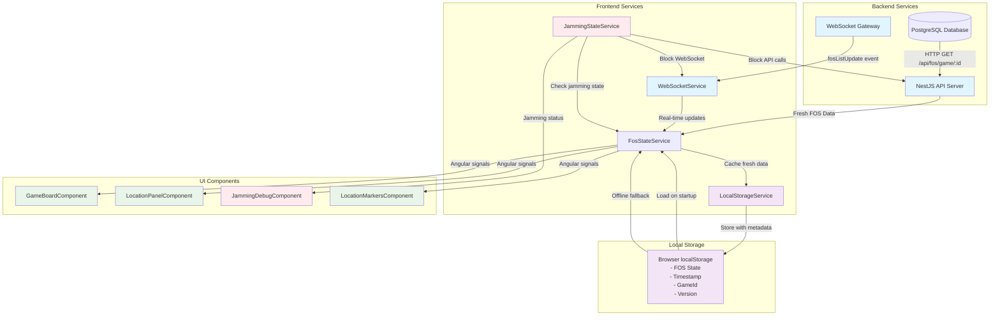
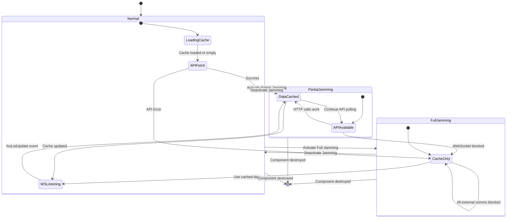

# Synthetic Jamming Architecture

## Overview
This diagram illustrates the offline-first architecture with synthetic jamming capabilities for the Pacific Shield wargaming platform.

## Data Flow Architecture



## State Transition Diagram



## Jamming Scenarios

### 1. Normal Operations (No Services Jammed)
```
┌─────────────┐  All Services  ┌──────────────┐    Signals    ┌─────────────┐
│   Backend   │ ──────────────▶│   Services   │ ─────────────▶│     UI      │
│             │                │              │               │             │
│ • FOS API   │ ✅ Available   │ • FosState   │               │ • FOS Icons │
│ • Player API│ ✅ Available   │ • WebSocket  │               │ • Panels    │
│ • Game API  │ ✅ Available   │ • Jamming    │               │ • Markers   │
│ • WebSocket │ ✅ Available   │ • LocalCache │               │ • Stats     │
│ • Intel API │ ✅ Available   │              │               │             │
│ • Logistics │ ✅ Available   │              │               │             │
└─────────────┘                └──────────────┘               └─────────────┘
                                       │                              ▲
                                       ▼                              │
                                ┌──────────────┐                     │
                                │ localStorage │ ────────────────────┘
                                │    Cache     │    Fresh data cached
                                └──────────────┘
```

### 2. Service-Specific Jamming (e.g., FOS API + WebSocket Jammed)
```
┌─────────────┐  Some Services ┌──────────────┐    Signals    ┌─────────────┐
│   Backend   │ ──────────────▶│   Services   │ ─────────────▶│     UI      │
│             │                │              │               │             │
│ • FOS API   │ ❌ JAMMED     │ • FosState   │               │ • FOS Icons │
│ • Player API│ ✅ Available   │ • WebSocket  │               │ • Panels    │
│ • Game API  │ ✅ Available   │ • Jamming    │               │ • Markers   │
│ • WebSocket │ ❌ JAMMED     │ • LocalCache │               │ • Stats     │
│ • Intel API │ ✅ Available   │              │               │             │
│ • Logistics │ ✅ Available   │              │               │             │
└─────────────┘                └──────────────┘               └─────────────┘
                                       ▲                              ▲
                                       │                              │
                                ┌──────────────┐                     │
                                │ localStorage │ ────────────────────┘
                                │    Cache     │    Cache-only for
                                └──────────────┘    jammed services
```

### 3. Critical Systems Jammed (All Combat APIs Down)
```
┌─────────────┐  Limited Svcs  ┌──────────────┐    Signals    ┌─────────────┐
│   Backend   │ ──────────────▶│   Services   │ ─────────────▶│     UI      │
│             │                │              │               │             │
│ • FOS API   │ ❌ JAMMED     │ • FosState   │               │ • FOS Icons │
│ • Player API│ ❌ JAMMED     │ • WebSocket  │               │ • Panels    │
│ • Game API  │ ❌ JAMMED     │ • Jamming    │               │ • Markers   │
│ • WebSocket │ ❌ JAMMED     │ • LocalCache │               │ • Stats     │
│ • Intel API │ ❌ JAMMED     │              │               │             │
│ • Logistics │ ✅ Available   │              │               │             │
└─────────────┘                └──────────────┘               └─────────────┘
                                       ▲                              ▲
                                       │                              │
                                ┌──────────────┐                     │
                                │ localStorage │ ────────────────────┘
                                │    Cache     │    Mostly cached data
                                └──────────────┘    only basic logistics
```

## Cache Structure

```typescript
interface CacheEntry<T> {
  data: T;                    // Actual FOS data
  timestamp: number;          // When cached (for age validation)
  gameId: number;            // Game scope (isolation)
  version: string;           // App version (compatibility)
}

// Example cache entry:
{
  "pacsim_fos_list": {
    "data": [
      {
        "id": "fos-1",
        "fosDisplayNumber": 1,
        "isActive": true,
        "teamId": 2,
        "turnActivated": 3
      }
    ],
    "timestamp": 1695234567890,
    "gameId": 123,
    "version": "1.0.0"
  }
}
```

## Service Responsibilities

### JammingStateService
- 🎛️ **Controls**: Service-specific communication permissions
- 📊 **Tracks**: Individual jammed services, duration, start time
- 🚦 **Provides**: `isServiceJammed(service)`, `jamServices()`, `removeJammedServices()`
- 📝 **Services**: FOS API, Player API, Game API, WebSocket, Intel API, Logistics API

### LocalStorageService
- 💾 **Stores**: Game-scoped data with metadata
- ✅ **Validates**: Cache age, version, game ID
- 🗑️ **Manages**: Cache cleanup and statistics

### FosStateService
- 🔄 **Implements**: Offline-first loading pattern with service-specific jamming checks
- 📡 **Integrates**: API, WebSocket, and cache sources with granular service blocking
- 🎯 **Exposes**: Angular signals for reactive UI
- 🛡️ **Respects**: Individual service jamming state for FOS API and WebSocket

### FosStateService Load Sequence
```
Page Load/Game Start
        │
        ▼
1. Check localStorage cache
        │
        ├─ Cache exists? ──► Load immediately (fast UI)
        │
        ▼
2. Check FOS API service jamming state
        │
        ├─ FOS API not jammed? ──► Fetch fresh data from FOS API
        │                                │
        │                                ▼
        │                         Update cache & UI
        │
        ├─ FOS API jammed? ──────► Use cache only for FOS data
        │
        ▼
3. Setup WebSocket listener
        │
        ├─ WebSocket not jammed? ──► Listen for fosListUpdate events
        │
        ├─ WebSocket jammed? ──────► Skip real-time updates
        │
        ▼
4. Angular signals update UI automatically when data changes
```

## Debug Panel Features

The `JammingDebugComponent` provides:

```
┌─────────────────────────────────────┐
│        🛰️ Synthetic Jamming Control │
├─────────────────────────────────────┤
│ Status: 🟢 Communications: NORMAL   │
│ Available Services: 6/6             │
│                                     │
│ FOS Cache Status:                   │
│ • Has Cache: Yes                    │
│ • Cache Age: 2 minutes              │
│ • FOSs Loaded: 12                   │
│ • Active FOSs: 3                    │
│                                     │
│ Service-Specific Jamming:           │
│ ┌─ FOS API      [Jam]   ✅         │
│ ┌─ Player API   [Jam]   ✅         │
│ ┌─ Game API     [Jam]   ✅         │
│ ┌─ WebSocket    [Jam]   ✅         │
│ ┌─ Intel API    [Jam]   ✅         │
│ ┌─ Logistics    [Jam]   ✅         │
│                                     │
│ [Jam Critical] [Restore All]        │
│ [Force Refresh] [Clear Cache]       │
└─────────────────────────────────────┘
```

## Benefits

1. **🚀 Fast Load**: Cache loads instantly on page refresh
2. **💪 Resilient**: Works offline during jamming scenarios
3. **🎯 Realistic**: Simulates real communication disruption
4. **🔧 Testable**: Debug panel for scenario validation
5. **⚡ Reactive**: Angular signals provide immediate UI updates
6. **🛡️ Safe**: Version checking prevents stale cache issues

This architecture ensures FOS icons maintain their state across page refreshes while providing realistic military communication disruption training scenarios.